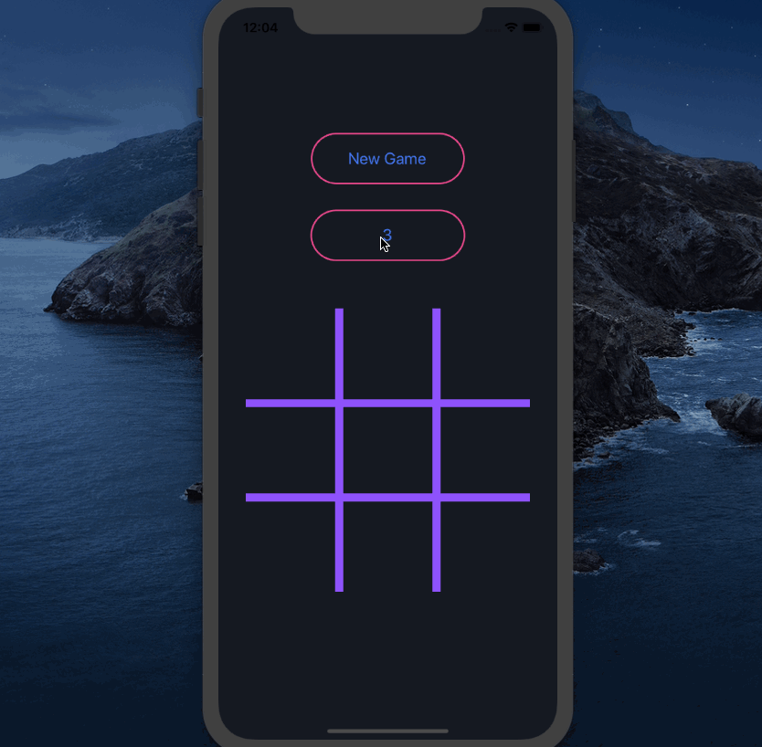

# Tic Tac Toe

### Demo
(This GIF is not high quality. The app runs much more smoothly.)



### Scope
* Allow 2 players to play tic tac toe
* Have 3x3 grid on which the players can play
* Allow the players to take turns marking spaces on the 3x3 grid
* Recognize when a player has won and declare that player as victorious
* Allow the user to start a new game
* Scalabe: Can change the size of the grid
* (Cannot mark cells that have already been marked, and cannot mark cells once a game has ended)
* (Player 1/"O" always starts)


### Prerequisites
[Node.js](https://nodejs.org/)

[Expo-CLI](https://expo.io/learn):
```
npm install -g expo-cli
```


### Recommended Devices
This app was developed on MacOS and tested with an iOS simulator (iPhone 11) and a physical iPhone XR. To use on a physical device, download the Expo app.
(There are issues with React Native's Modal component when running on a web browser.)


### Installing
Clone or download the repository, and then:
```
cd tictactoe
```

To install dependencies:
```
npm install
```


### Usage
To run the app:
```
expo start
```
Using the Expo Developer Tools, you can run it on an (iOS) simulator or by scanning the QR code with your phone's camera (provided you've downloaded the Expo app).
